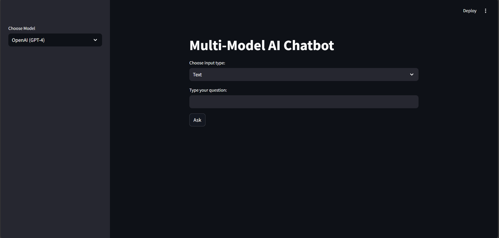

# Multi-Model-AI-Chatbot
An interactive AI chatbot using OpenAI, Google Gemini, and Groq models with support for text, audio, and image inputs built with Streamlit.

## Features
- Chat with multiple AI models (OpenAI GPT-4, Gemini, Groq)
- Upload audio and get transcription + AI response
- Upload images and ask questions about them
- Generate images using DALL-E 3
- Session-based chat history
- Clean UI with selectable input types

## Tech Stack
- Frontend and Framework: Streamlit
- Language: Python
- APIs:  OpenAI GPT-4 and Whisper-1  Google Gemini  Groq LLaMA
- Other tools:  Pillow  python-dotenv

## Project Structure
Multi-Model-AI-Chatbot/ 
|-- .env 
|-- .gitignore 
|-- app.py 
|-- README.md 

## Create a Virtual Environment(recommended) 
-- python -m venv venv 
-- source venv/bin/activate   # On macOS/Linux 
-- venv\Scripts\activate # On windows

## Install dependencies
pip install -r requirements.txt

## Set up .env file and store API keys 
OPENAI_API_KEY=your_openai_api_key 
GEMINI_API_KEY=your_gemini_api_key 
GROQ_API_KEY=your_groq_api_key

## Run Streamlit
streamlit run app.py

## Usage Guide
- Choose a Model  Select from OpenAI (GPT-4), Gemini, or Groq in the sidebar.
- Choose Input Type  Text: Type a question and get an AI response  Upload Image: Upload an image and ask about it  Upload Audio: Upload audio and get transcribed text  Generate Image: Provide a text prompt and generate an image

## Chatbot UI

